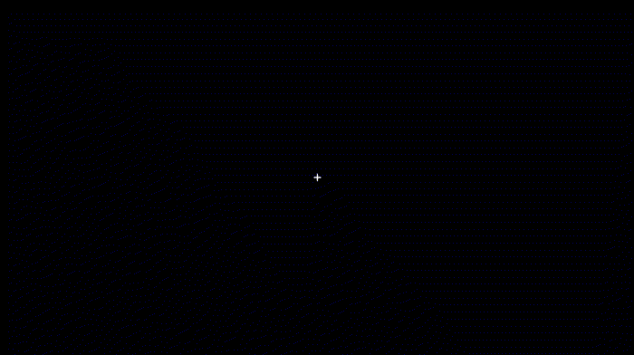

# DDiT
## Debris DIsks Tool


A Python code to (quickly) produce synthetic images of debris disks, in total and polarized intensity using the Henyey-Greenstein approximation. In the model, the disk is not infinitely flat and it should work for any inclinations except for `i=0` or `i=90` (otherwise there may be some division by zero).

### Installation and first try

To use the module, download the python files above and install it with the following (using the `develop` option so that any further changes are automatically included):
```python
python3 setup.py develop
```

Given that the code only uses matplotlib and numpy, it should work with python2 and python3. To compute a model, you can have a look at the end of the "DDiT.py" file, but in a nutshell, it is as simple as

```python
from DDiT import Disk
disk = Disk()
disk.compute_model(a = 0.6, i = 60., e = 0.3)
```

Alternatively, if you do not want to pass the arguments to the function (let's say you want to do some MCMC and want some liberty in choosing the free parameters), you can also do the following:

```python
from DDiT import Disk
disk = Disk()
disk.a = 0.6 # in units of arcseconds
disk.i = 60. * np.pi / 180.
disk.e = 0.3
disk.compute_model()
```
But in that case, you have to make sure that you put the angles in radians (and check the method `_check_parameters` to see how the position angle is defined). Once the model is computed, you will find the images in the variables `disk.intensity` and `disk.polarized` for the total and polarized intensity. Furthermore, in `disk.scattering`, `disk.distance`, and `disk.azimuth` you will have access to the scattering angle, the distance to the star, and the azimuthal angle, in the midplane.

### Description of the code

The way the code works is that it first finds a bounding box where most of the dust density distribution is contained. This bounding box, which is a 3D ellipse, is computed from the reference radius, the outer slope of the density distribution, and the eccentricity. Then, for each row of pixels perpendicular to the major axis of the disk (`x` axis), the `y` and `z` coordinates for the entry and exit points of the bounding box are estimated. The distance between the entry and exit points is divided in `nframe` images, and the 3D coordinates at the center of each cell are computed. The radial and vertical volumetric density are evaluated at the center of the grids, as well as the scattering angle, to compute the scattered light contribution. The final image is the sum of all those `nframe` images. The process is highlighted in the animation below.

<p align="center">
  
</p>

### Input parameters


## References

If you use this code for your research, feel free to contact me if you have any doubt or question, and please cite the following paper:
```
Olofsson et al. (2020)
The challenge of measuring the phase function of debris disks. Application to HR\,4796
```

